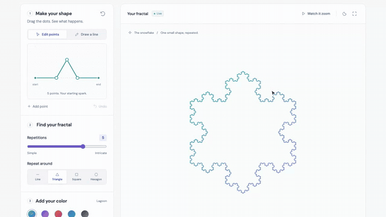

# FracGen

A free, visual fractal studio at [fracgen.xera.ac](https://fracgen.xera.ac/).

Draw a simple line, move its points, and turn it into a fractal. Explore named mathematical constructions, zoom into their details, and download an image or animation.



<sub>The shape editor, from the start of the tour. [Watch the full 120 second tour](documentation/tour.mp4):
dragging and adding points, repetitions, outlines and colors, a zoom, a drawn line growing, the
Mandelbrot set opened in the studio, and the Lévy C curve reshaped and zoomed.</sub>

## Run locally

Requires Node.js 22.12 or newer.

```sh
npm ci
npm run dev
```

```sh
npm test
npm run build
npm run preview
```

The production site is the static `dist/` directory. It needs no application server or database.

## Creating and exporting

- Drag the shape's points or use the drawing tool. Keyboard users can Tab to a point, move it with arrow keys, and remove it with Delete. Shift makes larger movements. Ctrl+Z or Cmd+Z undoes a shape edit.
- Choose the starting outline, repetition depth, and color palette. The repetitions slider stops at the deepest complete level under the 100,000 segment budget, up to 16.
- Open any library fractal in the studio. The line-based constructions (Koch curve, Koch snowflake, Minkowski curve, quadratic Koch island, Lévy C curve, and terdragon) become editable lines. The others keep their own rule and use the studio's detail, color, zoom, animation, and download controls.
- Animation settings offer a zoom journey or pattern growth, smooth or step-by-step playback, and a length of 1 to 30 seconds at 30 frames per second. Zooms keep a steady speed, so a longer animation goes deeper; the settings panel shows how deep the current design goes. The preview supports pausing and scrubbing.
- PNG exports are 2400 × 2400. Custom line drawings also export as SVG.
- GIF exports are 800 × 800 and loop. MP4 exports are 1200 × 1200. Animation files include a final pause. Large frame counts take longer to encode.
- MP4 requires browser video encoding support. When it is unavailable, the interface offers GIF instead.
- Drawings and exports stay in the browser. Download your work before leaving or reloading the page.

## Mathematical limits

The shape editor replaces every segment with a smaller transformed copy of the drawn line. The classic library includes distinct named constructions across several families; it is not an exhaustive list of all possible fractals. Each example links to a reference and has a practical detail ceiling.

Zooms move at a fixed speed: 4× per second for lines and escape-time sets, and 16× per 6 seconds for the other library geometry. Animation length therefore sets zoom depth, up to each design's detail limit, after which the view holds. Contracting custom lines are redrawn to 10¹² before floating-point precision runs out; noncontracting lines stop at 4,096×. Escape-time sets are recomputed at the current complex-plane coordinates, with limits measured per target (10¹¹ for the Mandelbrot seahorse valley, 10⁴ to 10¹² for the others). Other library geometry is stored at its maximum detail and stops where its finest pieces grow large on screen.

## Search and hosting

The entry document contains the page text, canonical URL, social metadata, and structured data. `public/robots.txt` and `public/sitemap.xml` point to the production domain. Fonts and images are hosted locally. Serve unknown paths as real 404 responses, keep the entry document fresh, and cache fingerprinted assets. Allow `blob:` images and media in the site's content security policy so animation previews can play.

Search engines control crawling, indexing, ranking, and the appearance of results. After the domain is live with HTTPS, submit the sitemap through the site's search console.

## The tour

```sh
npm run build && npx vite preview --port 4173 &
npm run tour -- http://localhost:4173   # writes documentation/tour.mp4 and tour.gif
```

Requires ffmpeg on the PATH and a one time `npx playwright install chromium`.

Playwright drives the production build and records it, so every zoom and dialog in the video is the one a visitor gets. It loads the page once and moves by clicking, dragging, typing, and scrolling, since a reload flashes white in the middle of the video. The screencast does not draw the mouse, so the recorder adds a small cursor that follows real input events; nothing is added to the app. Modal dialogs render above every z-index, so the cursor is a popover that is raised again whenever a dialog opens.

Animations play in the expanded preview, which fills the 1280 × 720 frame. The encode keeps the screencast's own 25 fps timing, because resampling duplicates frames unevenly and judders during zooms. The recorder checks key steps, such as the zoom reaching 4,096× and the Lévy C curve opening as three points, and warns when one does not, because a tour that skips a step looks exactly like one that does not. It exits with an error if the page throws.

The mp4 is the full tour and fits the 140 second video limit on X; the gif is the shape editor excerpt.

## License

MIT. The bundled DM Sans font uses the SIL Open Font License in `public/fonts/OFL.txt`.
